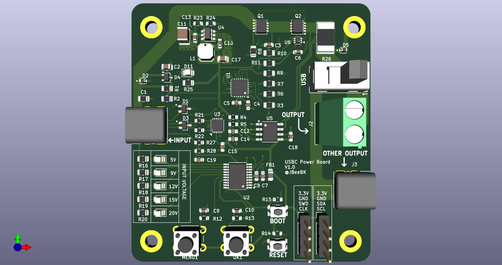

# USB-C PD Power Meter and Debug Tool

This project is a compact, professional-grade USB-C Power Delivery (PD) debug tool and power meter. Not finished yet tho. 
It’s designed to showcase modern hardware stuffs (USB-C, PD negotiation, embedded control, current/voltage sensing) and produce a **fully manufacturable, assembled board** 

---

## Features

- **USB-C PD Sink (STUSB4500)**: negotiates 5 V / 9 V / 12 V / 15 V / 20 V profiles.  
- **Current and Voltage Monitoring**: INA219 + voltage divider for real-time display.  
- **I²C OLED Menu System**: user-selectable voltage and output control with buttons.  
- **Temperature Monitoring**: TMP112 tracks board temperature for safety.  
- **Visual Indicators**: LEDs show active voltage selection (5 V–20 V).  
- **Output Flexibility**: USB-C and screw terminal outputs (user selects output).  
- **MCU Control**: STM32G030 (TSOP-20) manages I²C devices, UI, and safety cutoffs.  
- **Designed in KiCad 9**: manufacturable layout, not just breadboard-friendly.

---

## Current Status

- **Schematic completed** (`00_Hardware`).  
- **First-round PCB layout completed** (see image below).  
- Firmware and assembly guide are next steps.

---

## Board Preview

### Top View (First Layout)

---

## Repository Structure
00_Hardware/ # KiCad schematic, PCB, footprints, symbols
01_Docs/ # Design notes, app notes, calculations
02_Datasheets/ # Datasheets here
03_Output_PCB/ # Gerbers
04_Output_Assembly/ # Board renders and fabrication files
USB_PD_JB-backups/ # Auto-saved KiCad backups
output generator python script
README.md
.gitignore

